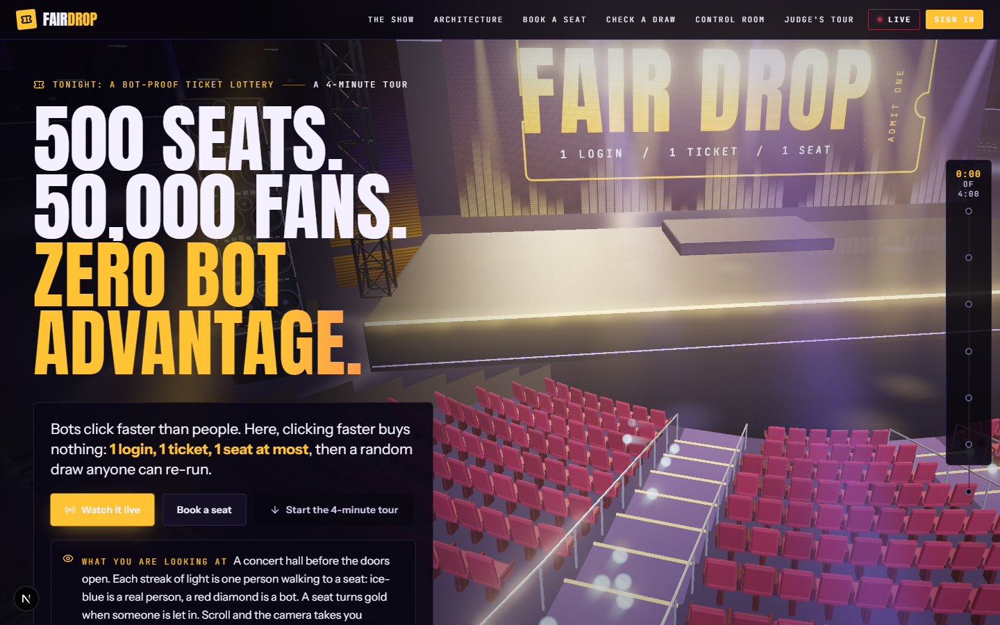
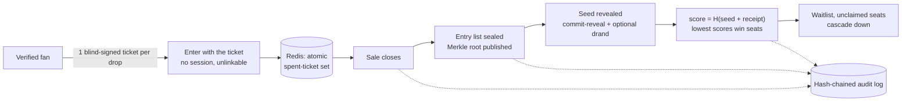
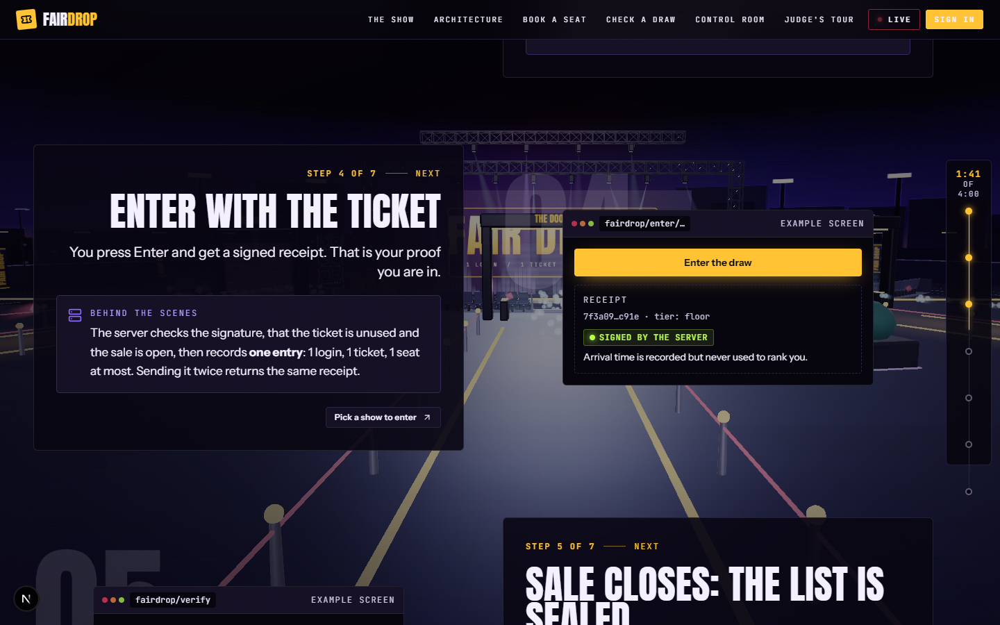
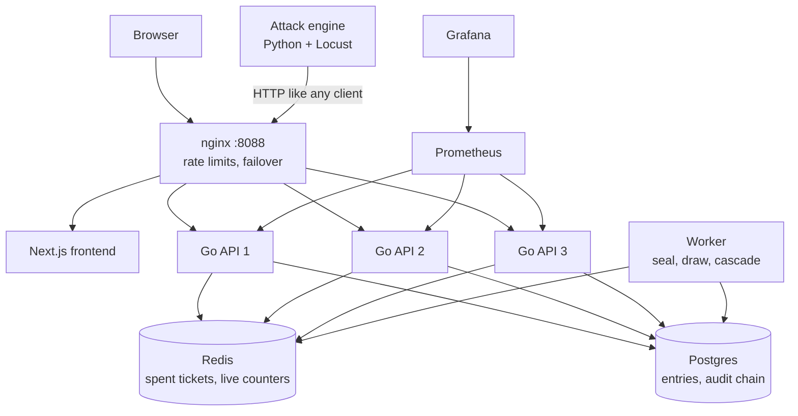

<div align="center">

# Fair Drop

**Bot-proof ticket drops. 500 seats, 50,000 fans, zero bot advantage.**

*One login, one entry, at most one seat. The list is sealed before the draw. Anyone can re-run it.*


### [**Live demo: fair-dropp.vercel.app**](https://fair-dropp.vercel.app/)

<sub>The live site is the frontend only (the 3D tour and pages). The Go backend and the attack simulation are not hosted, so the live arena and control room need the Docker setup below.</sub>



</div>

---

## The problem

When a popular show goes on sale, the first-come-first-served queue rewards whoever clicks fastest, sends the most requests, or rotates the most IP addresses. That is bots. Real fans lose.

## The idea

Fair Drop takes speed out of the contest. Being fast, sending more requests, or switching IPs buys nothing. The only thing that counts is **how many real verified identities you hold**, and each one gets exactly one entry.

> **Honest scope.** We do not claim bots are impossible. We claim a bot gets *nothing* from speed, volume or IP rotation, and that every extra seat costs it a real verified identity. The experiments below measure exactly that. All numbers come from our own simulation on one laptop, not from a certified audit.

## How it works



1. **One blind-signed token per drop** ([RFC 9474](https://www.rfc-editor.org/rfc/rfc9474.html)). The server signs the token without seeing it, so it cannot later link an entry to a person.
2. **Atomic registration.** Spending a ticket is a single Redis operation, so the same ticket can never enter twice. Sending twice returns the same receipt.
3. **The list is sealed first.** When the sale closes, all entries are Merkle-locked and the root is published *before* any randomness is revealed.
4. **A draw anyone can re-run.** The committed seed (plus an optional drand beacon chosen after the lock) produces `score = H(final seed || receipt)`. The lowest scores win. Anyone can recompute it with the reference verifier.
5. **Every event is hash-chained** into an audit log. Change one old event and the chain breaks at that exact spot.

Details: [docs/CRYPTOGRAPHY.md](docs/CRYPTOGRAPHY.md) and [docs/ARCHITECTURE.md](docs/ARCHITECTURE.md).

## What you can see

| Page | What it shows |
|---|---|
| `/` | A scroll-driven 3D concert hall that walks through one sale in about four minutes. |
| `/live` | The **Live Arena**: choose a crowd (real people plus 11 kinds of bots), press Start, and watch three methods side by side: first-come-first-served, a simple lottery, and Fair Drop. Hover a bot to see what it is doing. The screen checks its own numbers against each other. |
| `/admin` | The control room: server health, the judge's verdicts, tamper checks, research metrics, run-a-sale controls. |
| `/architecture` | A 3D model of the system: load balancer, three API replicas, Redis, worker, Postgres, attack engine. |
| `/verify` | Paste a receipt and check it against the sealed list. It goes red if your entry is missing. |

<div align="center">

</div>

## Results

Full scale (50,000 identities), one laptop, rate limits on, and a live first-come-first-served replay of the same actors. Raw data is in [`reports/`](reports/).

| Experiment | First come first served | Naive lottery | **Fair Drop** |
|---|---|---|---|
| **Proxy flood**: 20 operators × 10 identities, rotating IPs (bots are 0.4% of identities) | bots hold **20%** of seats, advantage **50×** | 14.1% of seats, **35×** | **0.4%** of seats, advantage **0.95×** |
| **One human vs ~50,000 bot requests** (10 seats, 21 identities) | human wins **0%** | 0% | human wins **46.5%** (ideal 47.6%) |
| **Tarpit**: API scrapers and UI mimics (10.6% of identities) | advantage 1.9× | 0.70× | **0.52×** |
| **Normal traffic**: 50,000 humans | 1.0% win | 1.0% | 1.0%, 0 errors, p99 register 44 ms |

**Buying identities (Sybil scaling).** Fair Drop cannot stop someone who owns 10,000 verified identities from winning about 11% of seats. It makes each seat cost roughly $300–$540 of identities (at an assumed $3 per identity, configurable) instead of about $3, and it removes every speed, volume and IP lever. The identity cost is the control, not the cryptography.

| Identities bought | First come first served: seats / cost per seat | Fair Drop: seats (expected) / cost per seat |
|---|---|---|
| 100 | 100 / $3 | **1.0 / $293** |
| 1,000 | 100 / $30 | 8.8 / $341 |
| 10,000 | 100 / $300 | **55.5 / $541** |

**Failure tests.**
- *Kill a replica mid-sale* (20,000 humans, `api-2` killed): 20,000 acknowledged receipts, **0 missing** from the Merkle tree, 0 client errors, all integrity counters 0, audit chain valid.
- *A malicious server drops one entry*: the victim's verify page turns **red**, the audit log shows `missing_receipts = 1`, and the reference verifier flags it.

## Research metrics

The control room scores the gate the way bot-detection reviews do: false-positive rate against a strict 0.1% target (with the rule-of-three upper bound when nothing went wrong), precision, recall, F1, balanced accuracy, and whether each bot kind arrives differently from real people (burstiness and KL distance). Ideas that do not apply (PR-AUC, mouse dynamics, fingerprinting) are listed with the reason. There is no single certified global benchmark for fair ticket queues, and the page says so. See [docs/RESEARCH_METRICS.md](docs/RESEARCH_METRICS.md).

## The 11 kinds of bots we throw at it

`SPEED_BOT` · `FLOOD_BOT` · `RETRY_BOT` · `PROXY_ROTATOR` · `SYBIL_OPERATOR` · `API_SCRAPER` · `UI_MIMIC` · `CRYPTO_SWARM` · `SMART_SCRAPER` · `STATE_SNIPER` · `CLAIM_SNIPER`

An independent judge, not the gate itself, labels every request as person or bot and grades each decision. Every kind, what it tries, and how Fair Drop handles it is in [docs/ATTACK_ENGINE.md](docs/ATTACK_ENGINE.md) and in the landing page's bots chapter.

## Quick start

Just want to look? Open the [live frontend](https://fair-dropp.vercel.app/). To run the full system (backend, live arena, attacks), you only need **Docker** (Compose v2) and about 6 GB of memory for it.

```bash
git clone https://github.com/ratneshdagli/Fair-Drop.git
cd Fair-Drop

docker compose up -d --build        # first build takes about 5-10 minutes
docker exec fd-nginx nginx -s reload
```

Then open **http://localhost:8088**. If a page is empty at first, wait 20 seconds and refresh.

To watch an attack: open `/admin`, sign in, press **Open the live screen**, keep the default crowd and press **Start**. A full test takes about 5 minutes.

| What | Where |
|---|---|
| Website | http://localhost:8088 |
| Control room | http://localhost:8088/admin |
| API | http://localhost:8088/api |
| Grafana | http://localhost:3001 |
| Prometheus | http://localhost:9090 |
| Attack engine control API | http://localhost:9200 |

The full guide, with troubleshooting and everyday commands, is [SETUP.md](SETUP.md).

> **Demo credentials, local only:** admin `admin` / `admin-demo-pass`, test key `test-key-demo`, `TEST_MODE=true`. Never expose this stack to the internet as it is. Set your own `JWT_SECRET`, `ADMIN_PASSWORD` and `TEST_KEY`, and set `TEST_MODE=false`, in `docker-compose.yml`.

### Run the experiments

```bash
scripts/run_experiment.sh exp2 --scale 0.1 --also-fcfs     # one experiment (exp1 to exp7)
scripts/run_all_experiments.sh --scale 1.0 --also-fcfs      # all seven, 50,000 identities
scripts/kill_replica.sh 2                                   # kill a replica mid-sale
scripts/run_malicious_demo.sh                               # a server that drops an entry
scripts/reset.sh                                            # wipe and start fresh
```

Windows: use the matching `scripts\*.ps1`. What every test means in plain words: [docs/TESTS_EXPLAINED.md](docs/TESTS_EXPLAINED.md). Commands: [docs/TESTING.md](docs/TESTING.md).

## Architecture



11 containers: 3 Go API replicas, a worker, Redis, Postgres, nginx, Prometheus, Grafana, the Next.js frontend, and the attack engine.

## Repository layout

| Folder | What is in it |
|---|---|
| `backend/` | Go API and worker (`cmd/fairdrop`, `internal/`) |
| `frontend/` | Next.js 16 fan site, live arena, control room, 3D landing and architecture scenes |
| `attack_engine/` | Locust profiles for the 11 bot kinds, scenarios, the independent judge, reporting |
| `scoring/` | Fairness maths (win rate, bot advantage, cost per seat) |
| `verifier/` | Standard-library Python verifier anyone can run on a receipt |
| `infra/` | nginx, Prometheus and Grafana config |
| `scripts/` | Start, seed, experiments, kill-a-replica, reset (shell and PowerShell) |
| `tests/` | End-to-end smoke test |
| `reports/` | Output of the seven experiments |
| `docs/` | Architecture, cryptography, API, research, tests, runbooks |

## License

[MIT](LICENSE)

## Documentation

[System analysis](docs/SYSTEM_ANALYSIS.md) · [Architecture](docs/ARCHITECTURE.md) · [Design decisions](docs/ARCHITECTURE_DECISIONS.md) · [Research](docs/RESEARCH.md) · [Research metrics](docs/RESEARCH_METRICS.md) · [API contract](docs/API_CONTRACT.md) · [Cryptography](docs/CRYPTOGRAPHY.md) · [Attack engine](docs/ATTACK_ENGINE.md) · [Fairness metrics](docs/FAIRNESS_METRICS.md) · [Red team](docs/RED_TEAM.md) · [Tests explained](docs/TESTS_EXPLAINED.md) · [Testing](docs/TESTING.md) · [Demo runbook](docs/DEMO_RUNBOOK.md) · [Judge walkthrough](docs/JUDGE_WALKTHROUGH.md) · [Performance notes](docs/PERF_NOTES.md) · [Hard-coded values audit](docs/HARDCODE_AUDIT.md) · [Dependencies](docs/DEPENDENCIES.md) · [Design system](DESIGN.md)

## Limits, stated plainly

- Someone who buys many real verified accounts still gets one entry per account. Fair Drop caps entries per person; it does not make buying identities impossible.
- A well-disguised bot cannot be blocked, only capped at one entry. Seats never depend on spotting bots.
- Results are measured on one laptop with a simulated crowd, not a measured human arrival law.
- The strict 0.1% false-positive target is a research choice, not a legal standard.
